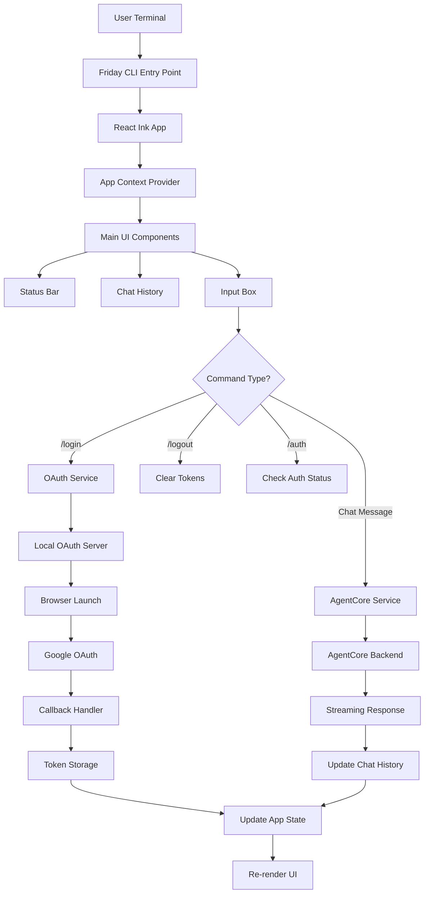
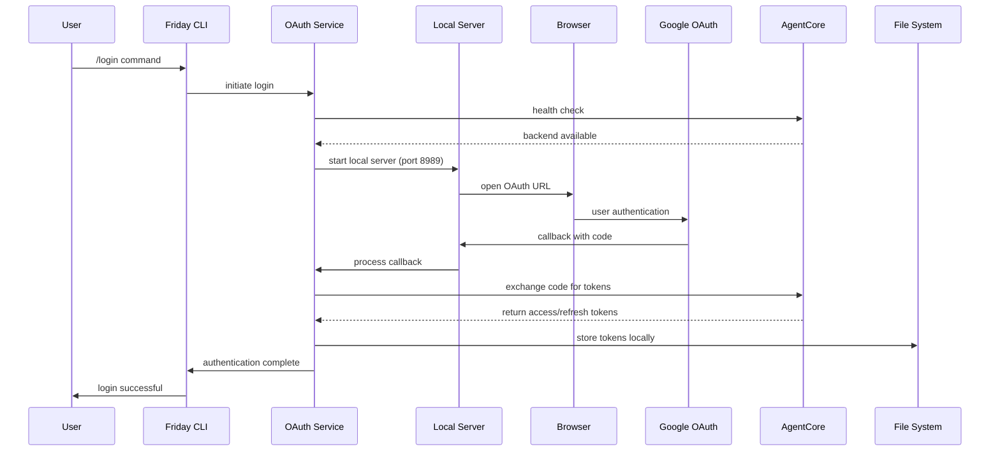
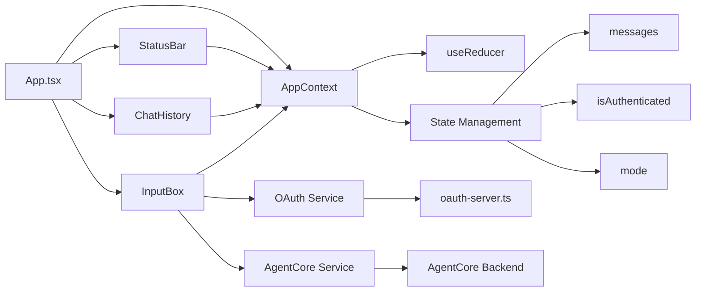
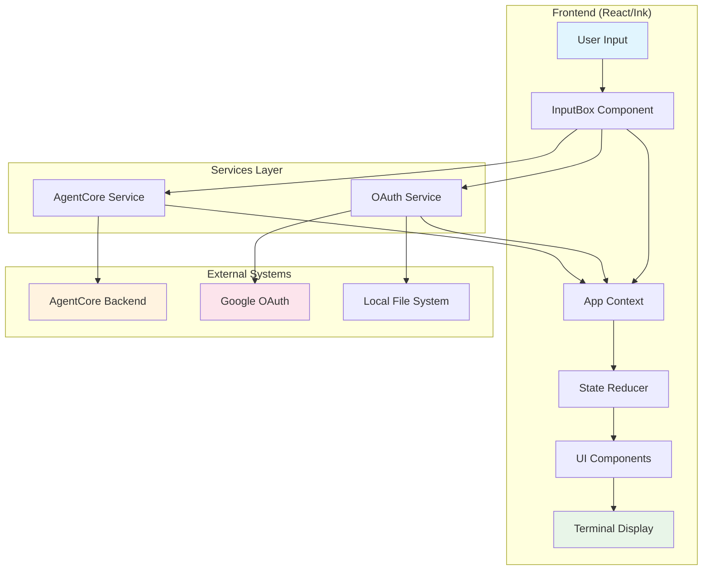
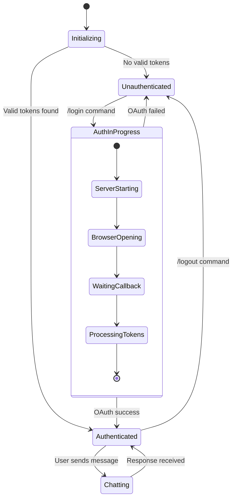

# Friday CLI Architecture Flow Diagrams

## Application Flow Chart



## Authentication Flow



## Component Interaction



## Data Flow Architecture



## State Management Flow



## Message Processing Pipeline

```mermaid
graph LR
    A[User Input] --> B{Is Command?}
    B -->|Yes| C[Command Router]
    B -->|No| D[Chat Message]

    C --> E[/login]
    C --> F[/logout]
    C --> G[/auth]
    C --> H[/help]
    C --> I[/exit]

    E --> J[OAuth Flow]
    F --> K[Clear Auth]
    G --> L[Check Status]
    H --> M[Show Help]
    I --> N[Exit App]

    D --> O[AgentCore API]
    O --> P[Streaming Response]
    P --> Q[Parse Chunks]
    Q --> R[Update History]

    style A fill:#bbdefb
    style D fill:#c8e6c9
    style O fill:#ffcdd2
```
